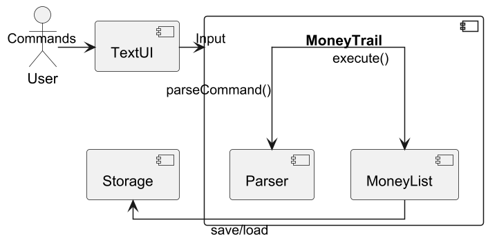
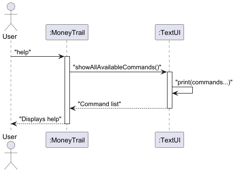
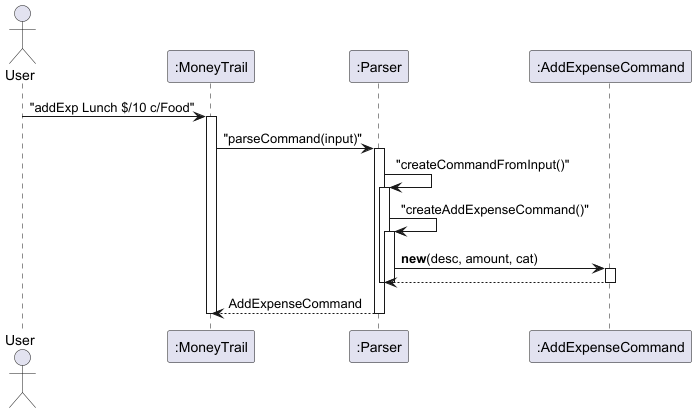
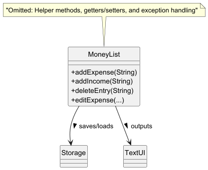
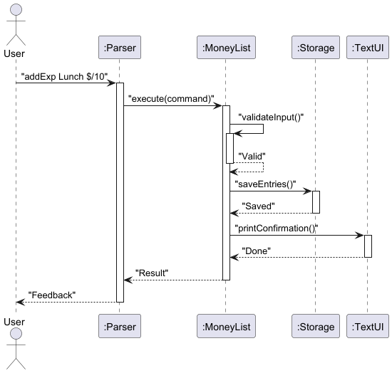
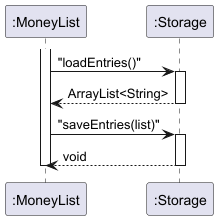
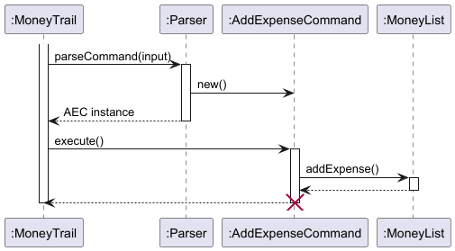
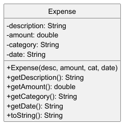
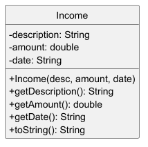
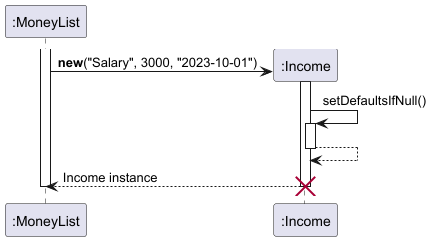

# Developer Guide

[1. Acknowledgements](#-acknowledgements) <br>
[2. Design](#-design) <br>
&nbsp;&nbsp;[3.1.0 UI Class](#310-ui-class) <br>
&nbsp;&nbsp;[3.1.1 DataStorage Class](#311-datastorage-class) <br>
&nbsp;&nbsp;[3.1.2 GroupStorage Class](#312-groupstorage-class) <br>
&nbsp;&nbsp;[3.1.3 Commands Class](#313-commands-class) <br>
&nbsp;&nbsp;[3.1.4 ExpenseCommands Classes](#314-expensecommands-classes) <br>
&nbsp;&nbsp;[3.1.5 FriendsCommands Class](#315-friendscommands-class) <br>
&nbsp;&nbsp;[3.1.6 SplitCommand Class](#316-splitcommand-class) <br>
&nbsp;&nbsp;[3.1.7 BudgetManager Class](#317-budgetmanager-class) <br>
&nbsp;&nbsp;[3.1.8 Expense Class](#318-expense-class) <br>
&nbsp;&nbsp;[3.1.9 Friend Class](#319-friend-class) <br>
&nbsp;&nbsp;[3.2.0 Group Class](#320-group-class) <br>
&nbsp;&nbsp;[3.2.1 GroupManager Class](#321-groupmanager-class) <br>
&nbsp;&nbsp;[3.2.2 Messages Class](#322-messages-class) <br>
&nbsp;&nbsp;[3.2.3 Summary Class](#323-summary-class) <br>
&nbsp;&nbsp;[3.2.4 ExpenseClassifier Class](#324-expenseclassifier-class) <br>
&nbsp;&nbsp;[3.2.5 Currency Class](#325-currency-class) <br>
[4. Overall Application Architecture](#4-overall-application-architecture) <br>
&nbsp;&nbsp;[4.1 Application Class Diagram](#41-application-class-diagram) <br>
&nbsp;&nbsp;[4.2 Expense CRUD Feature](#42-expense-crud-feature) <br>
&nbsp;&nbsp;[4.3 Create Group Feature](#43-create-group-feature) <br>
&nbsp;&nbsp;[4.4 Split Expense Feature](#44-split-expense-feature) <br>
&nbsp;&nbsp;[4.5 Change Currency Feature](#45-change-currency-feature) <br>
&nbsp;&nbsp;[4.6 Data Visualization Feature](#46-data-visualization-feature) <br>

## Acknowledgements
{list here sources of all reused/adapted ideas, code, documentation, and third-party libraries -- include links to the original source as well}

## Design

> [!TIP]
> Tip: The `.puml` files used to create diagrams in this document `docs/diagrams` folder.

### Architecture Overview


The **Architecture Diagram** given above explains the high-level design of the App.

Below is an overview of the main components and their interactions with one another:

The application is divided into several classes, each with a specific responsibility:
- `MoneyTrail`: The **main** class that initializes the application and handles user input.
- `MoneyList`: Manages the list of expenses and provides methods for adding, deleting, listing, and finding expenses.
- `Storage`: Handles loading and saving data to a file.
- `TextUI`: Manages user interface interactions, such as displaying messages and errors.
- `MTLogger`: Logs application events and errors for debugging and monitoring (Will not be discussed).
- `MTException`: A custom exception class for handling application-specific errors.
- `Expense`: Represents an expense entry with a description and amount.
- `Income`: Represents an income entry with a description, amount, date, and provides a formatted string for display.
- `Parser`: Processes user input and converts it into the corresponding Command object.
- `Command`: Defines a common interface for all operations that can be executed in the application.

### MoneyTrail Component: `MoneyTrail.java`

**Role**: Entry point and main controller of the application.

Here is the UML component diagram of `MoneyTrail.java`:



This UML component diagram illustrates `MoneyTrail.java`’s role 
as the central coordinator in the architecture:

- MoneyTrail (shown as a composite component) receives user input via TextUI and delegates parsing to the Parser.


- It forwards parsed commands to MoneyList for execution, which interacts with Storage to persist data.


- Simplifications: Logging and error-handling components are omitted to focus on core data flow.

Here is the UML sequence diagram of `MoneyTrail.java` touching only its main loop:


This UML sequence diagram captures the simplified command execution flow:

- The User submits an expense command (e.g., addExp Lunch $/10) through TextUI.


- MoneyTrail triggers parsing via Parser, which returns a concrete AddExpenseCommand.


- The command is executed by MoneyList, with results relayed back to TextUI.


- Simplifications: Uses pseudocode (processInput()) instead of exact method names.


- Key omission: Loop logic and error handling are excluded to highlight the happy path.

Here is the Java Code snippet showing the core loop:

```
public void run() {
  // ...
  while (!shouldExit) {
    String input = in.nextLine().trim();          // User input
    Command command = parser.parseCommand(input); // Delegates parsing
    command.execute(moneyList);                  // Delegates execution
  }
}
```

The provided Java snippet:

- Continuously reads user input (in.nextLine()).


- Delegates parsing to Parser and execution to MoneyList via the Command pattern.


- Focus: Demonstrates the class’s role as a facade without exposing internal details like logging.

### Text UI Component: `TextUI.java`

**Role**: Handles all user interactions and visual output for the MoneyTrail application.

Here is the UML class diagram of `TextUI.java`:


The simplified UML class diagram shows TextUI's core structure:

- Focuses on key public methods like print() and showAllAvailableCommands()


- Explicitly omits internal helpers (noted in comment)

Here is the UML sequence diagram of `TextUI.java`:



This UML sequence diagram demonstrates a typical command flow:

- User requests "help" via MoneyTrail


- TextUI activates to display command list


- Shows clean activation/deactivation lifecycle


- Simplified to one representative interaction and omits lower-level print operations

### Parser Component: `Parser.java`

**Role**:

- Translates raw user input into executable Command objects

- Validates input syntax

- Handles parsing errors with meaningful feedback

Here is the UML class diagram of `Parser.java`:

> [!NOTE]
> This class diagram only concerns parsing the command that adds expense entries.


This simplified UML class diagram shows the Parser's core structure:

- The Parser class depends on the Command interface to produce concrete command objects like AddExpenseCommand.


- Key methods like parseCommand() and factory methods (e.g., createAddExpenseCommand()) are highlighted, while internal helpers are omitted for clarity.

Here is the UML sequence diagram of `Parser.java`:



This UML sequence diagram illustrates the parsing workflow for an "add expense" command:

- User input flows from MoneyTrail to the Parser, which activates to process the request.


- The Parser delegates to specialized factory methods to instantiate a concrete AddExpenseCommand.

Here are the core Java Code snippets:

```
public Command parseCommand(String input) throws MTException {
  if (input.trim().isEmpty()) {
    throw new MTException("Empty command");  // Input validation
  }
  return createCommandFromInput(input);      // Delegation
}
```

This method demonstrates the Parser's two key responsibilities:

- Input validation (rejecting empty strings).


- Delegation to command-specific factory methods.

```
private Command createAddExpenseCommand(String input) throws MTException {
  // Simplified extraction:
  String[] parts = input.split("\\$/"); 
  double amount = Double.parseDouble(parts[1].split(" ")[0]);
  return new AddExpenseCommand(...);
}
```

This method shows simplified parsing logic for expense commands:

- Splits input to extract amount and description.


- Constructs a ready-to-execute AddExpenseCommand object.

### Money List Component: `MoneyList.java`

**Role**:

- Core data manager for all financial entries (expenses/incomes)

- Central hub for business logic operations

- Bridge between commands and storage

Here is the simplified UML class diagram of `MoneyList.java`:



This simplified UML diagram shows MoneyList's core structure:

- Manages an ArrayList of financial entries


- Collaborates with Storage (persistence) and TextUI (display)

Here is the UML sequence diagram of `MoneyList.java`:



This UML sequence diagram:

- Illustrates the addExpense workflow with activation bars:


- User command flows through Parser to MoneyList


- MoneyList validates input (nested activation)


- Saves via Storage and confirms via TextUI

Here are the Java Code snippets:

```
public void addExpense(String input) throws MTException {
  // Input parsing omitted
  Expense newExp = new Expense(desc, amount, cat, date);
  moneyList.add(newExp.toString());  // Store formatted string
  storage.saveEntries(moneyList);    // Persist
  ui.print("Added: " + newExp);     // Confirm
}
```

This snippet demonstrates three key responsibilities:

- Creates Expense object from parsed data


- Updates in-memory list


- Coordinates persistence and user feedback


- Shows clean separation of concerns

```
public void loadEntriesFromFile() throws MTException {
  moneyList.clear();
  moneyList.addAll(storage.loadEntries());  // Delegates IO
  logger.logInfo("Loaded " + moneyList.size() + " entries"); 
}
```

This snippet highlights storage integration:

- Clears current state


- Delegates file operations to Storage


- Logs results


- Emphasizes single responsibility principle

### Storage Component: `Storage.java`

**Role**: Handles all file I/O operations for persistent data storage, including:

- Saving entries to mt.txt

- Loading entries on startup

- Encapsulating filesystem interactions

Here is the UML class diagram of `Storage.java`:


This UML class diagram shows the Storage component's structure and its relationship with MoneyList:

- saveEntries() and loadEntries() define the file I/O interface.


- MoneyList depends on Storage for persistence but remains decoupled from file operations.


- Key Omissions: Internal helper methods and low-level file handling details are excluded for clarity.

Here is the UML sequence diagram of `Storage.java`:



**Warning**: Due to unexplained image exportation issues, some activation bars will have missing lines.
The original `.puml` files have complete activation bars.

This UML sequence diagram illustrates the file read/write workflow:

1. Loading Data:

- MoneyList activates Storage to load entries, which reads mt.txt before returning parsed data.

2. Saving Data:

- MoneyList triggers a save, with Storage writing all entries atomically.

### Command Component: `Command.java`

**Role**:

The Command interface defines the execution contract for all user actions in MoneyTrail, enabling:

- Uniform execution of diverse operations (add, delete, search)

- Decoupled control flow between parsing and execution

- Termination control for session management

Here is a simplified UML class diagram:


This class diagram:

- shows that all concrete commands implement the Command interface.


- simplifications: Only 4 representative commands shown (others follow same pattern) and method details omitted except interface signature.

Here is the UML sequence diagram that outlines the functionality of adding an expense entry:



This sequence diagram illustrates:

- The MoneyTrail component receives parsed AddExpenseCommand from the Parser.

- The command's execute() method activates to modify the MoneyList.

Here are the self-explanatory Java code snippets:

```
public interface Command {
    /**
     * @param moneyList Target list for modifications
     * @throws MTException On execution failures
     */
    void execute(MoneyList moneyList) throws MTException;

    /** @return true triggers application exit */
    boolean shouldExit();
}
```

```
class ExitCommand implements Command {
    @Override
    public void execute(MoneyList moneyList) {
        // No operation required
    }

    @Override
    public boolean shouldExit() {
        return true; // Signals termination
    }
}
```

### Expense Component: `Expense.java`

**Role**:

Models financial expenditure entries with:

- Description

- Amount

- Category (default: "Uncategorized")

- Date (default: "no date")

Here is a self-explanatory UML class diagram:



`Expense.java`'s toString() method prints out the string representation of an expense entry.
Stored expense entries also used this string format.

Here is a simplified UML sequence diagram:


This sequence diagram shows the end-to-end process of instantiating an Expense object:

- MoneyList initiates the creation by calling Expense's constructor with parameters ("Lunch", 10.50, etc.), shown by its activation bar spanning the entire operation.


- The Expense object activates during its initialization phase to handle default value assignment (like auto-setting "Uncategorized" for null categories).


- Control returns to MoneyList with the fully constructed Expense instance.

Here is a Java code snippet and its sample output:

```
// Creating and storing an expense
Expense lunch = new Expense("Lunch", 12.50, "Food", null);
moneyList.add(lunch.toString());  // Stores formatted string
```

Outcome:
```
"Expense: Lunch $12.50 {Food} [no date]"
```

### Income Component: `Income.java`

**Role**:

Models financial income entries with::

- Description (required)

- Amount (positive value)

- Date (default: "no date")

Here is a self-explanatory UML class diagram:



Here is a simplified UML sequence diagram:



The sequence diagram of `Income.java` shares the same underlying 
explanations as the sequence diagram of `Expense.java`.

Here is a self-explanatory Java code snippet and its sample output:

```
Income salary = new Income("Salary", 3000.00, null);
moneyList.add(salary.toString()); 
```

Outcome:
```
"Income: Salary $3000.00 [no date]"
```

## Implementations

## Product scope

### Target user profile
Tertiary students who:
- Are budget-conscious and want to track their spending
- Find it troublesome to log their expenses and income on pen and paper.
- Want a lightweight, fast, and offline personal finance tracker
- Appreciate having flexibility to edit, categorize, and budget their expenses and income

### Value proposition
MoneyTrail is a lightweight, user-friendly budget tracking application to help you achieve financial clarity
and peace of mind. Say goodbye to the hassle of pen and paper logging. MoneyTrail is designed for simplicity and efficiency, it empowers users to manage expenses, track spending,
and stay within budget — digitally and all in one place. Our tool transforms financial management into a stress-free experience.

## User Stories

| Version | As a ... | I want to ...                                                  | So that I can ...                                            |
|---------|----------|----------------------------------------------------------------|--------------------------------------------------------------|
| v1.0    | new user | see usage instructions                                         | refer to them when I forget how to use the application       |
| v1.0    | user     | view all expense entries                                       | review my recorded expenses                                  |
| v1.0    | user     | delete an expense entry                                        | remove entries I no longer need                              |
| v1.0    | user     | set a total budget limit                                       | monitor my expenses within a predefined limit                |
| v1.0    | user     | see the sum of all my expenses                                 | understand my total spending                                 |
| v2.0    | user     | add new expense with a description, amount, category, and date | keep track of my spending efficiently                        |
| v2.0    | user     | find an entry by name                                          | locate an entry without having to go through the entire list |
| v2.0    | user     | edit entries                                                   | update incorrect or outdated entries                         |
| v2.0    | user     | list all used categories                                       | analyze spending patterns across different categories        |
| v2.0    | user     | clear all entries                                              | reset the application entirely                               |

## Non-Functional Requirements

#### Usability
#### User-friendly Interface:
The application should have an intuitive design, making it easy for users to navigate and input data.

#### Error Feedback
Provide clear and actionable feedback when a user makes a mistake (e.g., invalid input format).

### Performance
#### Fast Response Time:
The application should process commands and display results within a fraction of a second
to ensure a smooth user experience

### Reliability
#### Error Recovery
The application should gracefully handle unexpected crashes or errors, saving user data wherever possible.

#### Accuracy
Calculations (e.g., total expenses, budget limits) must be precise and error-free.

## Glossary

| Term           | Definition                                                                                         | 
|----------------|----------------------------------------------------------------------------------------------------|
| Expense Entry  | A record in the application that captures the description, amount, category, and date of spending. |
| Category       | A label used to group similar expenses, such as Food, Transportation, or Entertainment.            |
| Index          | A number assigned to each entry in the list for easy identification and management.                |
| Budget         | A predefined limit set by the user to control and monitor overall spending.                        |
| Total Expenses | The sum of all recorded expenses, used to understand total spending.                               |
| Command        | A specific instruction given to the application to perform an action, such as addExp or del.       |
| Keyword        | A search term used to locate specific expense entries by their description.                        |
| Date           | The calendar date associated with an expense entry, used for tracking when the spending occurred.  |
| Clear Entries  | A feature that removes all records from the application, resetting it to its initial state.        |
| Edit           | The process of updating an existing expense entry with new details, such as amount or description. |
| Help Command   | A command help that provides a summary of all available commands and their formats.                |
| Usability      | The ease with which users can navigate and use the application’s features effectively.             |

## Instructions for manual testing

{Give instructions on how to do a manual product testing e.g., how to load sample data to be used for testing}

### Testing Basic Commands
#### help Command:
1. Input the help command.
2. Verify that a complete list of all available commands is displayed.
3. Check if the descriptions are accurate and easy to understand.

#### addExp Command:
1. Use the addExp command with valid input (e.g., addExp Lunch $/12.50 c/Food d/2023-10-15 ).
2. Verify the expense is added to the list with the correct details.
3. Try invalid inputs (e.g., missing the description or amount) and ensure the application provides proper error messages.

#### listAll Command:
1. Add a few test entries to the application (e.g., expenses like "Lunch" and "Coffee")
2. Run the list command and confirm that all expense entries are displayed.

#### del Command:
1. Use the del <index> command to delete a specific expense.
2. Verify the entry is removed and the remaining entries are renumbered correctly.
3. Attempt to delete a non-existent index and confirm the application handles it gracefully.

#### find Command:
1. Use find <keyword> to search for a specific entry.
2. Verify that only relevant entries matching the keyword are displayed.
3. Check for case sensitivity and partial matches (e.g., searching "lunch" vs "Lunch").

### Testing Budget Features
#### totalExp Command:
1. Add multiple expenses and run totalExp.
2. Verify the total sum of all expenses is calculated accurately.

#### setTotBgt Command:
1. Set a budget using setTotBgt <amount> (e.g., setTotBgt 500.00).
2. Verify that the budget limit is correctly stored.
3. Add expenses exceeding the budget and check if the application warns the user.

#### listCat Command:
1. Add expenses with various categories (e.g., Food, Transportation).
2. Run listCat and verify that all used categories are listed without duplicates.

### Testing Data Management
#### Loading Sample Data:
1. Locate the mt.txt file in the application's home folder
2. Edit the file to include the sample entries in the required format (e.g., `Expense: fuel $10.00 {transportation} [no date]` ).
3. Restart the application and run the `list` command to ensure that the sample data loads correctly.

#### Saving Data:
1. Add mew expenses using the `addExp` command.
2. Check if the mt.txt file reflects the changes immediately after the application modifies data.
3. Exit and restart the application, then confirm the changes persist

### Testing Application Behavior
#### Error Messages and Validation:
1. Provide invalid inputs for commands (e.g., non-numeric values for amounts, invalid date formats).
2. Ensure that the application displays clear and descriptive error messages.

#### Exiting Application:
1. Run the `exit` command.
2. Confirm that the application shuts down without errors and does not leave any processes running.
